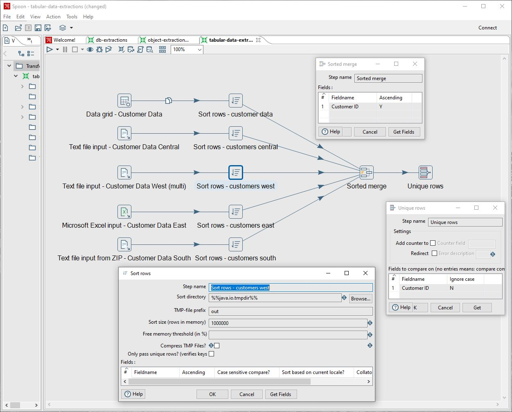
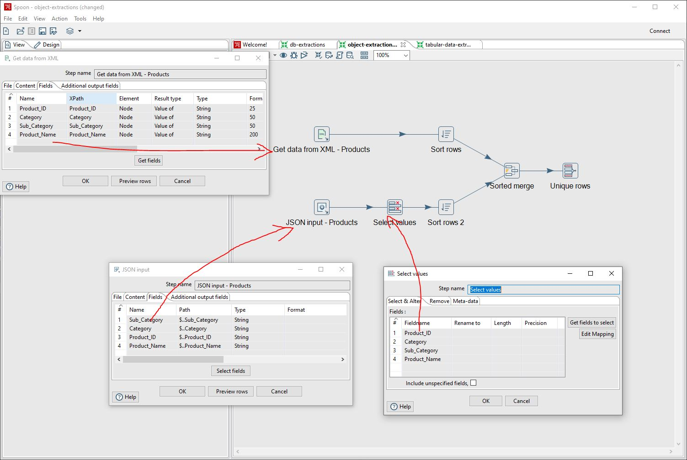
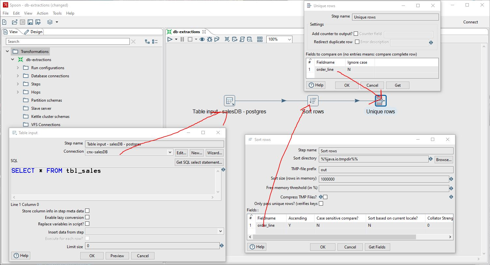

# Introduction
This repository contains example data and common activities used for ETL and Data Engineering using Pentaho Data Integration (PDI) Community Edition.

The examples and sample data are relatively simple but are normalized with relationships between customer, sales, and product data.

This project is simple;  however, can be applied to more complex contexts and used as a reference when extracting schemas, database, or flat file data types. 

More on Pentaho and it's use cases and features can be found [here](https://help.hitachivantara.com/Documentation/Pentaho/Data_Integration_and_Analytics/9.1/Products/Pentaho_Data_Integration).

## Table of Contents
* [Required Software](#required-software)
  * [Installing Java & Pentaho](#install-java-pentaho)
  * [Install Docker, PostgreSQL, PgAdmin](#install-docker)
  * [Seed Databse - Sales Data](#seed-database)
* [Extracting Tabular Data](#extracting-tabular-data)
  * [Basic Tabular Data Workflow - Customer Data](#tabular-data-workflow)
* [Extracting Object Data](#extracting-object-data)
  * [Basic Object Data Workflow - Product Data](#basic-object-data-workflow)
* [Extracting Database Data](#extracting-db-data)
  * [Basic Database Workflow - Sales Data](#db-data-workflow)

## Required Software

1. Pentaho Data Integration (PDI)
2. Docker (optional for setting up local postgreSQL database and extracting sample data)

### Installing Java & Pentaho

Here's a full guide on [installing Pentaho](https://www.hitachivantara.com/en-us/pdf/implementation-guide/three-steps-to-install-pentaho-data-integration-ce.pdf).

#### TL;DR
1. Download and install the latest Java JDK at [Java Downloads | Oracle](https://www.oracle.com/java/technologies/downloads/#jdk21-windows). 
2. Use the 'Base Install' of [Pentaho Community Edition | Hitachi Vantara](https://www.hitachivantara.com/en-us/products/pentaho-plus-platform/data-integration-analytics/pentaho-community-edition.html).
3. Extract the files into a new folder in your machine's Program Files (pc) or Applicaitons Folder (mac).
4. Run the *spoon.bat* file and Pentaho should fire up.

### Installing Docker, Setting up a PostgreSQL Database, PgAdmin

Here's the official documentation for [installing Docker](https://docs.docker.com/engine/install/)

#### TL;DR - get a local DB up and running with Docker
1. Download and install Docker and ensure sure it's running on your local machine
2. Clone this repo 
3. From the `/postgress-docker`folder run the following command `docker-compose up` 
4. This will spin up both a postgreSQL Database and a database admin server call PgAdmin (each will require 2g of memory on your machine. 4g total memory will be used).
5. Open your browser and Navigate to [https://localhost/8080](https://localhost/8080) to open PgAdmin.
6. Login with the credentials that are set from the [docker-compose.yml](postgress-docker\docker-compose.yml)
7. Setup up a new connection with the postgresDB called `db`

#### Seed Database

1. From the `db` container, navigate to the database location: `"/var/lib/postgresql/data/`
2. Copy the two .csv files in the [sample-data/sales](sample-data\sales) folder into the database's `/data` folder
3. Create a new `Query`
4. `CREATE TABLE` `tbl_sales` by running the first script in the [postgress-docker/create-sales-script.sql](postgress-docker\create-sales-script.sql)
5. Seed `tbl_sales` using the `COPY` scripts provided

Your database should not be seeded with sales data in the table called `tbl_sales`

---

### Extracting Tabular Data - Customer Data 

*Tabular data* in this context refers to data in *text/tab, csv, excel* files. 

Example tabular data extractions, use the example **Customer Data** uploaded to this repo.

**Pentaho Examples:** can be found in the **tabular-extractions.ktr** file in the [extractions](extractions/tabular-extractions.ktr) folder. 

The following use cases are:
* manually generated data grids within pentaho
* tab deliminated text files
* csv files
* multiple csv files
* excel files
* zip files containing multiple csv files

All of the sample data can be found in the **customers** folder under [sample data](sample-data) folder. 

#### Basic Tabular Data Workflow 

Select the Input Transformation
* [Data grid](https://pentaho-public.atlassian.net/wiki/spaces/EAI/pages/386800034/Data+Grid) for small sample data and testing
* [Text file input](https://help.hitachivantara.com/Documentation/Pentaho/Data_Integration_and_Analytics/9.4/Products/Text_File_Input) for single and multi-file inputs where you can use Regex on the file string to select multiple files. Can also be used for multiple files compressed in ZIP folder.
* [Microsoft Excel Input](https://help.hitachivantara.com/Documentation/Pentaho/Data_Integration_and_Analytics/9.4/Products/Microsoft_Excel_Input) for excel and multi sheet inputs 

In all of the above Inputs, you'll want to configure the meta-data fields so they are named exactly the same, in the same order, of the same type, and have the same length. 

Next, you'll do some sorting on each of the inputs based on a given key by using
* [Sort rows](https://help.hitachivantara.com/Documentation/Pentaho/Data_Integration_and_Analytics/9.4/Products/Sort_rows) to sort each of the inputs by either ASC or DESC order. This is a pre-processing step before you merge all of these seperate data streams into a single data stream

Next, you'll merge the data streams into single "Customers" stream.
* [Sorted Merge](https://pentaho-public.atlassian.net/wiki/spaces/EAI/pages/371558198/Sorted+Merge) using the key used from the Sort Rows step before.

Finally, remove duplicate data.
* [Unique Rows](https://help.hitachivantara.com/Documentation/Pentaho/Data_Integration_and_Analytics/9.4/Products/Unique_Rows) to remove duplicate rows from the merged data stream.

---

### Extracting Object/Schema Data - Customer Data 

*Object/Schema data* in this context refers to data in xml or json schemas

Example data extractions, use the example **products** data that's uploaded to this repo.

**Pentaho Examples:** can be found in the **object-extractions.ktr** file in the [extractions](extractions/object-extractions.ktr) folder.   

The following use cases are:
* xml schema
* json schema

All of the sample data can be found in the **products** folder under the [sample data](sample-data) folder. 

#### Basic Object Data Workflow 

Select the Input Transformation

* [xml](https://pentaho-public.atlassian.net/wiki/spaces/EAI/pages/372081230/Get+Data+From+XML) - Read in XML data using xPath node parsing

* [json](https://help.hitachivantara.com/Documentation/Pentaho/Data_Integration_and_Analytics/9.4/Products/JSON_Input) - Read in json data using JSONPath node parsing

Set the meta data (fields) for the inputs, ensuring fields are named exactly the same

If fields are not formatted the same, or require re-mapping, then use
* [select values](https://help.hitachivantara.com/Documentation/Pentaho/Data_Integration_and_Analytics/9.4/Products/Select_Values) - to format the fields so they match across pre-merged data streams

Finally, you'll sort streams, merge streams, and then select unique rows (just as you would with tabular data inputs)

----

### Extracting Database Data - Sales Data

Example database extractions, use the example sales Data uploaded to this repo.

Pentaho Examples: can be found in the **db-extractions.ktr** file in the [extractions folder](extractions).

The following use cases are:

* PostgreSQL database

All of the sample data can be found in the **sales** folder under the [sample data](sample-data) folder. 

#### Basic Object Data Workflow 

Select the Input Transformation

* [Table Input](https://help.hitachivantara.com/Documentation/Pentaho/Data_Integration_and_Analytics/9.4/Products/Table_Input)

Create a new connection to the Database using credentials and port number

Select the SQL Query to be used. This extraction is very simple and selects all data in the table tbl_sales

`SELECT * FROM tbl_sales`

Next, you'll sort the rows and then select unique IDs has done in previous steps. 

___ 

## Data Cleaning

